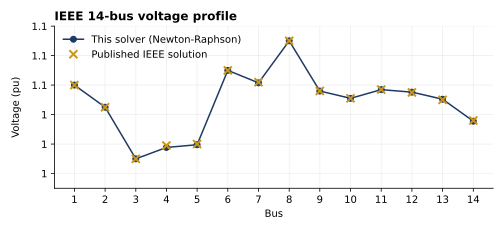
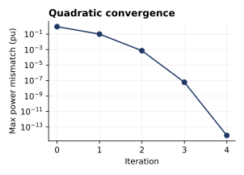
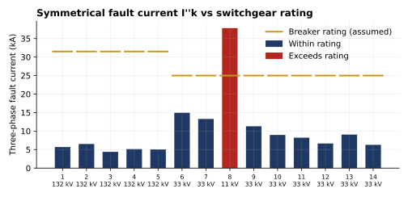

# Power System Studies: Load Flow and Short-Circuit Analysis

[](https://github.com/fatinnihal532-hub/power-system-studies/actions/workflows/ci.yml)
[](https://colab.research.google.com/github/fatinnihal532-hub/power-system-studies/blob/main/run_in_colab.ipynb)

This repository runs the two studies a utility or EPC engineer carries out before a network change:
a **load flow**, to check voltages and line loading, and a **short-circuit study**, to check that
the switchgear can interrupt the worst-case fault. Both are written from scratch in Python and NumPy
and run on the IEEE 14-bus test system.

| | Result |
|---|---|
| Load flow | Newton-Raphson, converges in 4 iterations to a 4e-15 pu mismatch |
| Accuracy | Agrees with pandapower to 1e-11 pu; total losses 13.393 MW, matching MATPOWER |
| Fault study | Three-phase and single-line-to-ground faults at all 14 buses, with IEC 60909 peak current |
| Finding | The 11 kV synchronous-condenser bus sees 37.8 kA, above a 25 kA switchgear rating |

## Load flow



The solver builds the bus admittance matrix, including off-nominal transformer taps and line
charging, then runs a full Newton-Raphson in polar form. The Jacobian comes from the complex
derivatives of the bus injections. Every bus voltage matches the published IEEE solution to within
its printed precision (0.0013 pu, 0.017°). The heaviest circuit is line 1–2, which carries 156.9 MW
and loses 4.30 MW.



The power mismatch roughly squares at every step, which is the quadratic convergence expected from
Newton's method.

## Short-circuit study and breaker duty



Fault currents are found with the bus impedance (Zbus) method using superposition. The pre-fault
voltages come from the load flow, machines are modelled as an EMF behind subtransient reactance X'',
and loads become constant admittances. For each bus the study reports:

* symmetrical fault current I''k (kA) and fault level (MVA)
* X/R ratio at the fault point
* peak current ip = κ·√2·I''k, with κ = 1.02 + 0.98·e^(−3R/X) (IEC 60909-0)
* single-line-to-ground fault current, from series-connected sequence networks

Full results are in [`results/fault_study.csv`](results/fault_study.csv).

**Finding.** Bus 8 is the 11 kV terminal of a synchronous condenser. With X'' = 0.25 pu it sees
37.8 kA symmetrical and 101 kA peak, and its X/R of 24.6 means a large DC offset. This exceeds a
25 kA breaker, so the choice is 40 kA switchgear or a current-limiting reactor. Every other bus is
within rating.

## Assumptions

The IEEE 14-bus case gives load-flow data only, so the fault study needs extra inputs. These are
collected in [`pss/assumptions.py`](pss/assumptions.py) and can be changed in one place:

* voltage levels follow a 132/33/11 kV structure, as in the Bangladesh grid
* machine X'' = 0.20–0.25 pu on the 100 MVA base
* breaker ratings of 31.5 kA at 132 kV and 25 kA at 33 kV and 11 kV
* the zero-sequence network is illustrative only: lines have Z0 = 3Z1, transformers are Yg–Yg and
  neutrals are solidly grounded. SLG currents therefore represent a solidly grounded worst case. In
  practice, generator neutrals are usually impedance-grounded to limit these currents.

## How the results are checked

`python verify.py` runs 9 checks, and `pytest` runs 7 tests:

* the load flow matches the published IEEE voltages and MATPOWER's losses, and agrees with pandapower
  to 1e-8 pu
* a two-bus network whose answer can be worked out by hand (KVL closes to 1e-10)
* the power balance closes: generation equals load plus losses
* every Zbus fault current is recomputed independently by solving the nodal equations with the fault
  inserted, and the two agree to 1e-8
* the SLG fault shows zero current in the healthy phases, and the faulted phase carries 3·I0

## Run it

```bash
pip install -r requirements.txt
python -m pytest -q      # tests
python verify.py         # checks behind every number quoted above
python make_figures.py   # regenerates docs/*.svg and results/*.csv
```

Or open the Colab notebook using the badge at the top.

## Layout

```
pss/network.py      network data, Ybus with taps and line charging, IEEE 14-bus case
pss/loadflow.py     Newton-Raphson load flow, branch flows and losses
pss/fault.py        Zbus fault analysis, IEC 60909 peak factor, sequence networks
pss/assumptions.py  voltage levels, machine reactances, breaker ratings
verify.py           numbered checks for every figure in this README
make_figures.py     figures and CSV tables
```

---
Fatin Nihal Islam · EEE, KUET · [Portfolio](https://fatinnihal532-hub.github.io) · [LinkedIn](https://www.linkedin.com/in/fatin-nihal-islam2002)
